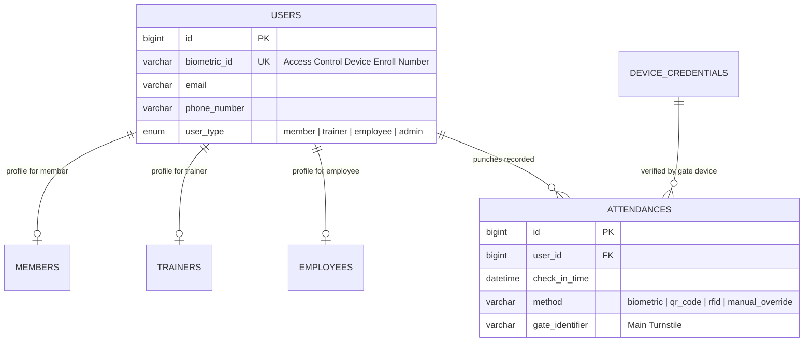
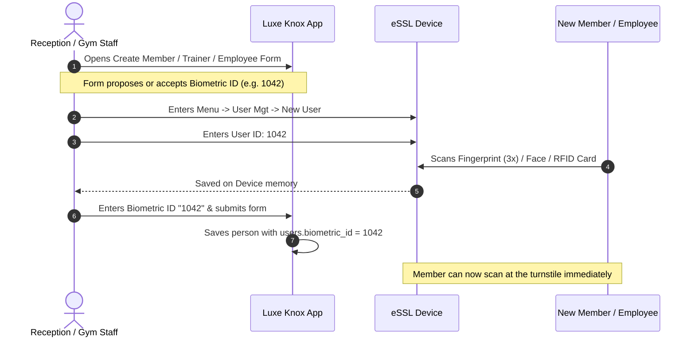

# Plan: Biometric ID (Access Control Device ID) & eSSL Device Ingest Architecture

This design and implementation plan addresses:
1. Adding `biometric_id` (Access Control Device ID) across the create and edit pages for **Members**, **Trainers**, and **Employees** across Database, Backend API, OpenAPI spec, and Flutter UI.
2. Operational and automated workflows for **how to register a new person** on eSSL biometric/face/RFID devices.
3. Architecture and integration patterns for **how to read attendance logs from IP-based eSSL access control devices** into Luxe Knox.

---

## 1. High-Level Architecture & Entity Relationship

In access control hardware (eSSL / ZKTeco), physical readers (fingerprint, facial recognition, RFID turnstiles) identify individuals using an internal **User ID / Enroll Number** (numeric or alphanumeric string, e.g., `101`, `1002`).

In Luxe Knox, physical facility attendance is recorded in the `attendances` table against `user_id` (`users.id`). Since members, trainers, and employees all share the same entrance turnstiles/doors and share the unified `users` table:



### Key Design Decisions
- **`users.biometric_id` as Single Source of Truth**: Storing `biometric_id` as a unique, nullable column on `users` ensures that no two people (e.g. a member and an employee) are assigned the same device ID on the physical machine, which would cause identity ambiguity when punching.
- **Single-Query Punch Resolution**: When a punch arrives from an eSSL terminal with device user ID `1001`, the backend resolves `users.biometric_id = 1001` in $O(1)$ time and attributes the check-in immediately to the proper `user_id`.
- **Surfaced on Member, Trainer, and Employee DTOs**: Create and update endpoints for all three roles accept `biometric_id`, persisting it through `PersonFactory` inside the atomic registration transaction.

---

## 2. Operational Guide: How to Register a New Person

When a new member, trainer, or employee joins, their biometric credentials must exist both on the physical device and in Luxe Knox. There are two primary workflows:

### Workflow A: Device-Assisted Enrollment (Standard & Recommended)
This is the standard operational procedure for standalone eSSL IP devices (e.g. eSSL K90, MB20, SilkBio-101, uFace, TF1700):



1. **ID Allocation**: The gym staff allocates an ID (e.g., auto-suggested or sequential ID `1042`, or the member's card number).
2. **Device Enrollment**: Staff taps `Menu` -> `User Mgt` -> `New User` on the eSSL terminal, enters `1042`, and prompts the person to scan their fingerprint 3 times (or face / card).
3. **App Creation**: Staff enters `1042` into the `Biometric ID` field in the Luxe Knox Create Member / Trainer / Employee form and saves.

### Workflow B: Automated Push via Local Network Bridge Daemon
If the gym wants staff to never touch the device keypad to enter names or IDs:
1. When staff clicks "Create Member" in Luxe Knox, the backend emits a `person.created` event.
2. A lightweight background bridge service on the gym local LAN (running on reception PC or mini-controller) connects to `essl_ip:4370` using the ZK protocol (`node-zklib` / `pyzk`).
3. The bridge executes `zk.setUser(uid, biometric_id, name, cardno)`.
4. The member is automatically provisioned on the machine. Staff then simply presses `Menu` -> `User Mgt` -> select the user -> scan finger/face template.

---

## 3. Architecture: How to Read Attendance from IP-Based eSSL Devices

eSSL devices communicate over Ethernet/Wi-Fi using one of two primary mechanisms:

```mermaid
flowchart TD
    subgraph Gym Hardware
        D1[eSSL Device 1: Turnstile Entry]
        D2[eSSL Device 2: Turnstile Exit]
    end

    subgraph Option 1: Direct Cloud Push (ADMS / Cloud Server)
        D1 -- "HTTP POST /iclock/cdata\n(Realtime on punch)" --> IngestCloud["Luxe Knox API\n(ADMS / Gate Ingest Endpoint)"]
    end

    subgraph Option 2: Local LAN Daemon Bridge
        D2 -- "ZK Protocol (TCP 4370)" --> BridgeDaemon["Local Sync Daemon\n(Node.js / Python on Gym PC)"]
        BridgeDaemon -- "HTTPS POST /attendances/check-in\nHeader: X-Device-Key" --> IngestAPI["Luxe Knox API\nPOST /attendances/check-in"]
    end

    IngestCloud --> Resolve["Resolve users.biometric_id\n-> users.id"]
    IngestAPI --> Resolve
    Resolve --> AttnService["AttendanceService.checkIn()\n(Method: biometric)"]
    AttnService --> DB[(MySQL / Drizzle)]
```

### Option 1: ADMS / Cloud Server Direct Push (Best for Cloud Deployments)
Most eSSL models (eSSL K90, SilkBio, MB20, etc.) include **ADMS (Automatic Data Master Server)** / "Web Server" firmware settings:
1. **Device Configuration**:
   - In device menu: `Comm.` -> `Cloud Server` / `ADMS`.
   - Server Address: `api.luxeknox.com` (or IP).
   - Server Port: `443` (or `80`).
   - Enable Push: `ON`.
2. **Punch Ingestion**:
   - Each time a person places their finger/face/card, the device immediately dispatches an HTTP POST to `/iclock/cdata?SN=<device_serial>&table=ATTLOG`.
   - The body contains lines formatted as:
     `<biometric_id>\t<timestamp>\t<in_out_status>\t<verify_mode>`
   - Luxe Knox provides an ADMS-compatible endpoint in `apps/api/src/attn/` that parses the punch, looks up `users.biometric_id`, and creates the attendance record with `method: 'biometric'`.

### Option 2: Local Network Bridge Daemon (Universal for All eSSL Models)
For devices without cloud firmware or when devices reside on an isolated local network:
1. A small Node.js service (using `node-zklib`) runs on the gym local machine.
2. It listens to real-time logs from the device on TCP port `4370`:
   ```ts
   const zk = new ZKLib('192.168.1.201', 4370, 10000, 4000);
   await zk.createSocket();
   await zk.getRealTimeLogs(async (data) => {
     // data: { userId: '1001', attTime: '2026-09-29 18:00:00' }
     await fetch('https://api.luxeknox.com/attendances/check-in', {
       method: 'POST',
       headers: {
         'Content-Type': 'application/json',
         'X-Device-Key': process.env.GYM_DEVICE_KEY,
       },
       body: JSON.stringify({
         biometric_id: data.userId,
         method: 'biometric',
         gate_identifier: 'Main Turnstile',
       }),
     });
   });
   ```
3. The existing `POST /attendances/check-in` endpoint authenticates the device key, resolves `biometric_id`, and records attendance in real time.

---

## 4. Proposed Code Changes

Grouped logically from the database layer through backend API, OpenAPI, and Flutter UI.

### Component 1: Database Schema & Migration (`apps/api`)
#### [MODIFY] `apps/api/src/platform/db/schema/users.ts`
- Add `biometric_id: varchar('biometric_id', { length: 64 })`.
- Add unique index `uniqueIndex('users_biometric_id_unique').on(table.biometric_id)`.

---

### Component 2: Backend People & Attendance Services (`apps/api`)
#### [MODIFY] `apps/api/src/people/person.factory.ts`
- Add `biometric_id?: string | null` to `PersonCredentials` or `CreatePersonInput`.
- Persist `biometric_id` in `insertUser()`.

#### [MODIFY] `apps/api/src/people/member.dto.ts`
- Add `biometric_id: z.string().max(64).optional().nullable()` to `createMemberSchema` and `updateMemberSchema`.
- Include `biometric_id: string | null` in `MemberResponseDto`.

#### [MODIFY] `apps/api/src/people/trainer.dto.ts`
- Add `biometric_id: z.string().max(64).optional().nullable()` to `createTrainerSchema` and `updateTrainerSchema`.
- Include `biometric_id: string | null` in `TrainerResponseDto`.

#### [MODIFY] `apps/api/src/people/employee.dto.ts`
- Add `biometric_id: z.string().max(64).optional().nullable()` to `createEmployeeSchema` and `updateEmployeeSchema`.
- Include `biometric_id: string | null` in `EmployeeResponseDto`.

#### [MODIFY] `apps/api/src/people/member.service.ts`, `trainer.service.ts`, `employee.service.ts`
- Pass `biometric_id` to factory/repository on create and update.

#### [MODIFY] `apps/api/src/attn/attendance.dto.ts`
- Add `biometric_id: z.string().max(64).optional()` to `checkInRequestSchema`.

#### [MODIFY] `apps/api/src/attn/attendance.service.ts` & `hardware-ingest.adapter.ts`
- When `dto.biometric_id` is passed, lookup `user` by `biometric_id` via `UserRepository.findByBiometricId()`.
- Record check-in for the resolved `user.id` with `method: 'biometric'`.

---

### Component 3: OpenAPI Specification (`docs/openapi/v1.yaml`)
#### [MODIFY] `docs/openapi/v1.yaml`
- Update `User` schema: add `biometric_id: { type: string, nullable: true }`.
- Update `MemberCreate`, `MemberUpdate`, `Member`: add `biometric_id`.
- Update `TrainerCreate`, `TrainerUpdate`, `Trainer`: add `biometric_id`.
- Update `EmployeeCreate`, `EmployeeUpdate`, `Employee`: add `biometric_id`.
- Update `CheckInRequest`: add `biometric_id: { type: string }`.

---

### Component 4: Flutter Entities, Form Cubits & UI Screens (`app/lib`)
#### [MODIFY] Domain Entities (`app/lib/features/people/domain/entities/`)
- `new_member_input.dart`: add `final String? biometricId;`
- `new_trainer_input.dart`: add `final String? biometricId;`
- `new_employee_input.dart`: add `final String? biometricId;`
- `person.dart`, `trainer_profile.dart`, `employee_summary.dart`: add `biometricId`.

#### [MODIFY] `app/lib/features/people/presentation/people_strings.dart`
- Add:
  - `static const String biometricId = 'Biometric ID (Access Control Device ID)';`
  - `static const String biometricIdHelper = 'Device user ID / Enroll number configured on eSSL hardware';`

#### [MODIFY] `app/lib/features/people/presentation/screens/add_member_wizard_screen.dart`
- Add `_biometricIdController`.
- Add `TextField` for `Biometric ID` in Step 1 (Basic Info) or Step 2 (Contact & Account).
- Pass `biometricId` to `cubit.updateInput`.

#### [MODIFY] `app/lib/features/people/presentation/screens/add_trainer_screen.dart`
- Add `_biometricIdController`.
- Add `TextField` for `Biometric ID` in form.
- Pass `biometricId` to `TrainerFormCubit`.

#### [MODIFY] `app/lib/features/people/presentation/screens/employee_form_screen.dart`
- Add `_biometricIdController`.
- Add `TextField` for `Biometric ID` in create/edit views.
- Pass `biometricId` to `EmployeeFormCubit`.

#### [MODIFY] `app/lib/features/people/presentation/screens/edit_member_screen.dart` & `edit_trainer_profile_screen.dart`
- Include `biometric_id` in edit forms so staff can update or assign device IDs to existing members and trainers.

---

## 5. Verification Plan

### Automated Tests
1. **Backend Unit & Integration Tests**:
   - `pnpm --filter @luxe/api test src/people/person.factory.spec.ts`
   - `pnpm --filter @luxe/api test src/people/member.service.spec.ts`
   - `pnpm --filter @luxe/api test src/people/trainer.service.spec.ts`
   - `pnpm --filter @luxe/api test src/people/employee.service.spec.ts`
   - `pnpm --filter @luxe/api test src/attn/attendance.service.spec.ts`
2. **Flutter Unit & Widget Tests**:
   - `cd app && flutter test test/features/people/`

### Manual Verification
1. Open Member Add Wizard -> Enter `Biometric ID: 1001` -> Complete creation -> Verify created member record contains `biometric_id: 1001`.
2. Open Add Trainer -> Enter `Biometric ID: 1002` -> Submit -> Verify trainer profile has device ID.
3. Open Add Employee -> Enter `Biometric ID: 1003` -> Submit -> Verify employee profile has device ID.
4. Send simulated eSSL punch to `POST /attendances/check-in` with `X-Device-Key` and `biometric_id: 1001` -> Verify member check-in is logged with `method: biometric`.
