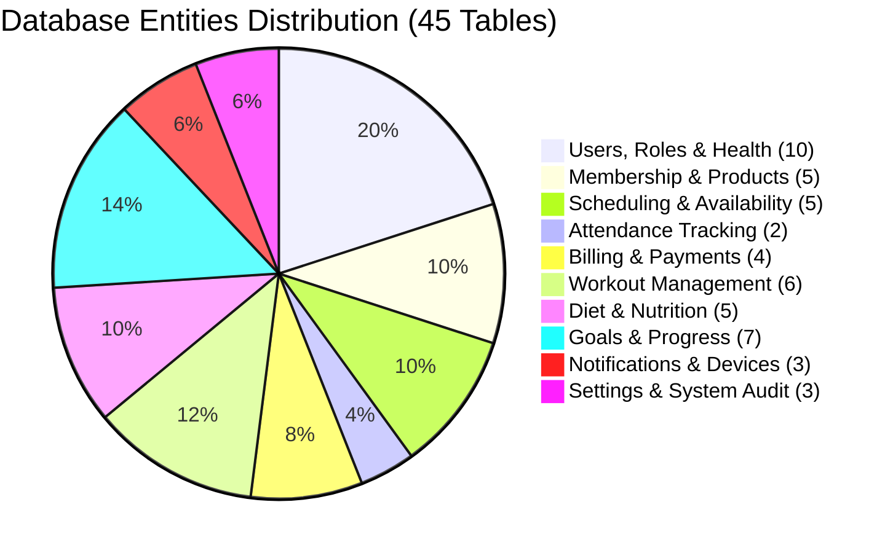

# Gym App — Database Entities (Tables) Specification

This document defines the relational database entities (tables) required to support all **44 consolidated MVP screens** across the **Member App**, **Trainer App**, and **Admin / Office App**.

---

## Architecture Overview

The database architecture is designed with:
1. **Unified User Identity & RBAC**: A central `users` table linked to role-specific profile extensions (`members`, `trainers`, `employees`).
2. **Temporal & History Tracking**: Explicit audit and history tables for memberships, schedules, and measurement progressions.
3. **Template & Versioning Pattern**: Workout and Diet plans support templates and version snapshots when modified for specific members.

---

## Entity Count by Domain

---

## 1. Users, Roles & Profiles

### `users`
* **Purpose**: Core authentication identity and master account table.
* **Supporting Screens**: All screens (Login, Session auth, User headers).
* **Key Attributes**: `id`, `email`, `phone_number`, `password_hash`, `user_type` (member, trainer, employee, admin), `status` (active, inactive, suspended), `created_at`, `updated_at`.

### `roles`
* **Purpose**: RBAC role definitions.
* **Supporting Screens**: Staff Directory & Roles, Gym Settings.
* **Key Attributes**: `id`, `name` (Super Admin, Manager, Receptionist, Trainer, Member), `description`, `is_system_role`.

### `permissions`
* **Purpose**: Granular feature capabilities.
* **Supporting Screens**: Staff Directory & Roles.
* **Key Attributes**: `id`, `module`, `action` (create, read, update, delete, approve), `slug`.

### `role_permissions`
* **Purpose**: Many-to-many junction between roles and permissions.
* **Supporting Screens**: Staff Directory & Roles.
* **Key Attributes**: `role_id`, `permission_id`.

### `members`
* **Purpose**: Member-specific profile details.
* **Supporting Screens**: Profile Screen, Edit Profile, Members Directory, Member Dossier.
* **Key Attributes**: `id`, `user_id` (FK), `membership_number`, `first_name`, `last_name`, `gender`, `date_of_birth`, `address`, `assigned_trainer_id` (FK to trainers), `joined_date`, `notes`.

### `trainers`
* **Purpose**: Trainer qualifications and employment data.
* **Supporting Screens**: Trainer Profile, Staff Directory, My Trainer Screen.
* **Key Attributes**: `id`, `user_id` (FK), `first_name`, `last_name`, `bio`, `specializations` (JSON/text), `hourly_rate`, `rating`, `max_clients_capacity`, `is_active`.

### `employees`
* **Purpose**: Staff records for front desk, management, and maintenance.
* **Supporting Screens**: Staff Directory & Roles, Employee Profile.
* **Key Attributes**: `id`, `user_id` (FK), `job_title`, `department`, `hire_date`, `emergency_contact`, `status`.

---

## 2. Health & Medical Records

### `member_health`
* **Purpose**: General physical metrics, blood group, and medical declaration.
* **Supporting Screens**: Health Information Screen, Member Dossier.
* **Key Attributes**: `id`, `member_id` (FK), `blood_group`, `height_cm`, `baseline_weight_kg`, `allergies`, `dietary_preferences`, `physician_name`, `physician_phone`, `updated_at`.

### `health_conditions`
* **Purpose**: Master classification of known conditions (Asthma, Hypertension, Diabetes).
* **Supporting Screens**: Health Information Screen.
* **Key Attributes**: `id`, `condition_name`, `risk_level`, `contraindications`.

### `medical_histories`
* **Purpose**: Historical injuries, surgeries, and physical limitations.
* **Supporting Screens**: Medical History Screen, Member Dossier.
* **Key Attributes**: `id`, `member_id` (FK), `condition_id` (FK nullable), `title`, `description`, `diagnosed_date`, `clearance_status`, `document_url`.

### `emergency_contacts`
* **Purpose**: Emergency contact directory for members and staff.
* **Supporting Screens**: Emergency Contacts Screen, Member Dossier.
* **Key Attributes**: `id`, `user_id` (FK), `contact_name`, `relationship`, `phone_primary`, `phone_secondary`, `is_primary`.

### `member_documents`
* **Purpose**: Uploaded identity documents, waivers, and certificates.
* **Supporting Screens**: Documents & Photos Gallery, Member Dossier.
* **Key Attributes**: `id`, `member_id` (FK), `document_type` (id_proof, waiver, medical_cert), `title`, `file_url`, `file_size`, `verified_by_user_id` (FK), `verified_at`.

### `member_photos`
* **Purpose**: Avatar and membership ID verification photographs.
* **Supporting Screens**: Profile Screen, Attendance Check-In Feed.
* **Key Attributes**: `id`, `member_id` (FK), `photo_url`, `is_current_avatar`, `captured_at`.

---

## 3. Memberships & Products

### `membership_products`
* **Purpose**: Catalog of sellable membership packages and tiers.
* **Supporting Screens**: Membership Packages Catalog, Membership Details.
* **Key Attributes**: `id`, `name`, `code`, `description`, `duration_days`, `base_price`, `tax_percentage`, `max_freeze_days`, `pt_sessions_included`, `access_facilities` (JSON), `is_active`.

### `memberships`
* **Purpose**: Active contract instance purchased by a member.
* **Supporting Screens**: Membership Details & Status, Memberships Directory, Dashboard.
* **Key Attributes**: `id`, `member_id` (FK), `product_id` (FK), `start_date`, `end_date`, `remaining_pt_sessions`, `status` (active, expired, frozen, cancelled), `locker_number`, `auto_renew`.

### `membership_freezes`
* **Purpose**: Membership hold/pause requests and approvals.
* **Supporting Screens**: Freeze & Extension Manager, Membership Details.
* **Key Attributes**: `id`, `membership_id` (FK), `start_date`, `end_date`, `total_freeze_days`, `reason`, `status` (pending, approved, rejected), `reviewed_by_user_id` (FK), `reviewed_at`.

### `membership_extensions`
* **Purpose**: Manual or compensatory extensions granted to a membership.
* **Supporting Screens**: Freeze & Extension Manager.
* **Key Attributes**: `id`, `membership_id` (FK), `days_extended`, `reason`, `granted_by_user_id` (FK), `created_at`.

### `membership_histories`
* **Purpose**: Audit log of all plan changes, upgrades, and renewals.
* **Supporting Screens**: Membership History Screen.
* **Key Attributes**: `id`, `membership_id` (FK), `action` (created, renewed, upgraded, frozen, expired), `old_end_date`, `new_end_date`, `performed_by_user_id` (FK), `timestamp`.

---

## 4. Scheduling & Availability

### `schedule_types`
* **Purpose**: Types of bookings (1-on-1 PT, Studio Class, Open Gym Slot).
* **Supporting Screens**: Schedule Calendar, Create Booking Screen.
* **Key Attributes**: `id`, `name`, `color_code`, `default_duration_minutes`, `requires_trainer`.

### `facilities` (Rooms / Studios)
* **Purpose**: Gym rooms or designated spaces (Studio A, Spinning Hall, Main Floor).
* **Supporting Screens**: Schedule Details Screen, Create Booking Screen.
* **Key Attributes**: `id`, `name`, `capacity`, `location_details`, `is_active`.

### `schedules`
* **Purpose**: Scheduled sessions, classes, or PT bookings.
* **Supporting Screens**: Schedule Calendar, Schedule Details Screen, Create Booking Screen.
* **Key Attributes**: `id`, `schedule_type_id` (FK), `facility_id` (FK), `trainer_id` (FK nullable), `title`, `start_time`, `end_time`, `max_capacity`, `status` (scheduled, ongoing, completed, cancelled), `notes`.

### `schedule_participants`
* **Purpose**: Junction tracking members booked for a session.
* **Supporting Screens**: Schedule Details Screen, Session Attendance.
* **Key Attributes**: `id`, `schedule_id` (FK), `member_id` (FK), `booking_status` (booked, waitlisted, cancelled), `attended` (boolean), `booked_at`, `marked_at`.

### `trainer_availabilities`
* **Purpose**: Trainer recurring shifts and date-specific block-outs.
* **Supporting Screens**: Trainer Availability Screen, Schedule Calendar.
* **Key Attributes**: `id`, `trainer_id` (FK), `day_of_week` (0-6), `start_time`, `end_time`, `is_recurring`, `override_date` (nullable), `is_available`.

### `schedule_histories`
* **Purpose**: Audit log of cancellations, reschedules, and attendance marks.
* **Supporting Screens**: Schedule History Screen.
* **Key Attributes**: `id`, `schedule_id` (FK), `action`, `changed_by_user_id` (FK), `notes`, `timestamp`.

---

## 5. Attendance Tracking

### `attendances`
* **Purpose**: Clock-in and clock-out check-in records.
* **Supporting Screens**: Attendance Pass & Check-In, Attendance History Log, Dashboard.
* **Key Attributes**: `id`, `user_id` (FK), `check_in_time`, `check_out_time`, `method` (qr_code, rfid, biometric, manual_override), `gate_identifier`, `verified_by_user_id` (FK nullable).

### `attendance_histories`
* **Purpose**: Historical aggregates and turnstile access audits.
* **Supporting Screens**: Attendance Analytics Dashboard, Reports.
* **Key Attributes**: `id`, `date`, `total_member_checkins`, `total_trainer_checkins`, `peak_hour`, `peak_count`.

---

## 6. Billing, Invoices & Payments

### `payment_methods`
* **Purpose**: Master payment methods (Cash, Card, UPI, Bank Transfer).
* **Supporting Screens**: Record Payment / POS Screen.
* **Key Attributes**: `id`, `method_name`, `is_digital`, `is_active`.

### `payments` (Invoices & Transactions)
* **Purpose**: Financial billing ledger and transactions.
* **Supporting Screens**: Payments & Invoices Ledger, Record Payment / POS Screen, Outstanding Dues Screen.
* **Key Attributes**: `id`, `invoice_number`, `member_id` (FK), `membership_id` (FK nullable), `payment_method_id` (FK), `subtotal`, `tax_amount`, `discount_amount`, `total_amount`, `amount_paid`, `status` (paid, partial, pending, refunded), `transaction_reference`, `cashier_user_id` (FK), `payment_date`.

### `payment_receipts`
* **Purpose**: Generated digital invoice receipts.
* **Supporting Screens**: Payment Receipt Screen, Payment Details Screen.
* **Key Attributes**: `id`, `payment_id` (FK), `receipt_number`, `receipt_pdf_url`, `generated_at`.

### `payment_histories`
* **Purpose**: Audit trail of installments, adjustments, and refunds.
* **Supporting Screens**: Payments Ledger Screen.
* **Key Attributes**: `id`, `payment_id` (FK), `action` (payment_received, refunded, adjusted), `amount`, `notes`, `timestamp`.

---

## 7. Workout Management

### `exercises`
* **Purpose**: Master exercise library.
* **Supporting Screens**: Exercise Library Screen, Exercise Details Modal.
* **Key Attributes**: `id`, `name`, `primary_muscle_group`, `secondary_muscles` (JSON), `equipment_needed`, `instructions`, `video_url`, `gif_url`, `difficulty_level`, `is_active`.

### `workout_plans`
* **Purpose**: Routines created for a member or saved as gym templates.
* **Supporting Screens**: Workout Plans Catalog, Workout Plan Details, Workout Plan Builder.
* **Key Attributes**: `id`, `title`, `description`, `member_id` (FK nullable - null means master template), `trainer_id` (FK), `target_goal`, `difficulty`, `duration_weeks`, `is_template`, `status` (active, archived, draft), `created_at`.

### `workout_plan_versions`
* **Purpose**: Revision snapshots when routines are tweaked.
* **Supporting Screens**: Workout Plan Details Screen.
* **Key Attributes**: `id`, `workout_plan_id` (FK), `version_number`, `changelog`, `created_at`.

### `workout_plan_exercises`
* **Purpose**: Ordered list of exercises in a plan split.
* **Supporting Screens**: Workout Plan Details, Workout Plan Builder.
* **Key Attributes**: `id`, `workout_plan_id` (FK), `day_number` (e.g. Day 1 = Chest/Triceps), `exercise_id` (FK), `order_index`, `target_sets`, `target_reps`, `target_weight_kg`, `rest_seconds`, `notes`.

### `workout_sessions`
* **Purpose**: Live or logged workout instance performed by a member.
* **Supporting Screens**: Live Workout Session Tracker, Workout History Screen.
* **Key Attributes**: `id`, `member_id` (FK), `workout_plan_id` (FK nullable), `trainer_id` (FK nullable), `started_at`, `completed_at`, `total_volume_kg`, `duration_minutes`, `client_feedback_rating`, `notes`.

### `workout_session_exercises`
* **Purpose**: Set-by-set execution logs.
* **Supporting Screens**: Live Workout Session Tracker.
* **Key Attributes**: `id`, `workout_session_id` (FK), `exercise_id` (FK), `set_number`, `reps_completed`, `weight_lifted_kg`, `rpe_score`, `is_completed`.

---

## 8. Diet & Nutrition Management

### `foods`
* **Purpose**: Nutritional database items.
* **Supporting Screens**: Food Library Screen, Diet Plan Builder.
* **Key Attributes**: `id`, `name`, `serving_unit` (grams, ml, pieces), `serving_size`, `calories`, `protein_grams`, `carbs_grams`, `fat_grams`, `fiber_grams`, `is_verified`.

### `diet_plans`
* **Purpose**: Nutrition plans created for members or saved as templates.
* **Supporting Screens**: Diet Plans Catalog, Diet Plan Details, Diet Plan Builder.
* **Key Attributes**: `id`, `title`, `member_id` (FK nullable - null means template), `trainer_id` (FK), `daily_calorie_target`, `protein_target_g`, `carbs_target_g`, `fat_target_g`, `is_template`, `status`, `created_at`.

### `diet_plan_meals`
* **Purpose**: Structured daily meal windows (Breakfast, Lunch, Pre-workout, Dinner).
* **Supporting Screens**: Diet Plan Details, Diet Plan Builder.
* **Key Attributes**: `id`, `diet_plan_id` (FK), `meal_name`, `scheduled_time`, `target_calories`, `notes`.

### `diet_plan_foods`
* **Purpose**: Food items and quantities prescribed per meal.
* **Supporting Screens**: Diet Plan Details, Diet Plan Builder.
* **Key Attributes**: `id`, `diet_plan_meal_id` (FK), `food_id` (FK), `quantity`, `serving_unit`.

### `diet_histories` (Food Intake Logs)
* **Purpose**: Member daily dietary adherence logs.
* **Supporting Screens**: Diet History & Food Log.
* **Key Attributes**: `id`, `member_id` (FK), `logged_date`, `diet_plan_id` (FK), `total_calories_consumed`, `adherence_score`, `water_intake_ml`, `member_notes`.

---

## 9. Goals, Progress & Measurements

### `goal_metrics`
* **Purpose**: Configurable measurable parameters (Weight, Body Fat, Chest, Biceps, Bench Press).
* **Supporting Screens**: Goal Metrics Config, Measurements Screen.
* **Key Attributes**: `id`, `name`, `unit_of_measure` (kg, lbs, cm, in, %), `category` (body_composition, circumference, strength), `is_active`.

### `goals`
* **Purpose**: Member personal fitness milestones.
* **Supporting Screens**: Goals Hub & Details, Adaptive Dashboard.
* **Key Attributes**: `id`, `member_id` (FK), `metric_id` (FK), `baseline_value`, `target_value`, `current_value`, `start_date`, `target_date`, `status` (in_progress, achieved, abandoned).

### `goal_histories`
* **Purpose**: Milestone check-in log towards a goal.
* **Supporting Screens**: Goals Hub & Details.
* **Key Attributes**: `id`, `goal_id` (FK), `recorded_value`, `recorded_date`, `notes`.

### `measurements`
* **Purpose**: Periodic body measurement session record.
* **Supporting Screens**: Measurements & History Screen.
* **Key Attributes**: `id`, `member_id` (FK), `recorded_by_user_id` (FK), `recorded_at`, `notes`.

### `measurement_values` (Measurement History)
* **Purpose**: Individual metric values captured during a measurement session.
* **Supporting Screens**: Measurements & History Screen.
* **Key Attributes**: `id`, `measurement_id` (FK), `metric_id` (FK), `value`.

### `progress_photos`
* **Purpose**: Transformation comparison photographs.
* **Supporting Screens**: Progress Photos Gallery.
* **Key Attributes**: `id`, `member_id` (FK), `photo_url`, `pose` (front, side, back), `taken_date`, `is_private`.

### `progress_notes`
* **Purpose**: Dual notes stream between member and coach.
* **Supporting Screens**: Progress Notes Screen.
* **Key Attributes**: `id`, `member_id` (FK), `author_user_id` (FK), `note_text`, `note_type` (member_note, trainer_assessment), `created_at`.

---

## 10. Notifications & Messaging

### `notification_types`
* **Purpose**: Classification of automated and manual alerts.
* **Supporting Screens**: Notifications Inbox, Gym Settings.
* **Key Attributes**: `id`, `type_code` (membership_expiry, session_reminder, payment_due, announcement), `template_text`.

### `notifications`
* **Purpose**: Dispatched notification messages.
* **Supporting Screens**: Notifications Inbox & Details, Broadcast / Send Notification.
* **Key Attributes**: `id`, `notification_type_id` (FK), `title`, `message`, `data_payload` (JSON), `sender_user_id` (FK nullable), `created_at`.

### `user_devices`
* **Purpose**: Registered mobile and web push tokens for FCM/APNS.
* **Supporting Screens**: Background push service.
* **Key Attributes**: `id`, `user_id` (FK), `device_token`, `device_platform` (ios, android, web), `last_active_at`.

### `notification_deliveries`
* **Purpose**: Per-user notification receipt and read status.
* **Supporting Screens**: Notifications Inbox Screen.
* **Key Attributes**: `id`, `notification_id` (FK), `user_id` (FK), `is_read`, `read_at`, `delivered_at`.

---

## 11. System Configuration & Audit

### `gym_settings`
* **Purpose**: Facility operating parameters and configuration flags.
* **Supporting Screens**: Gym & Hardware Settings.
* **Key Attributes**: `id`, `setting_key`, `setting_value`, `category` (general, attendance_gate, booking_rules, billing, workout).

### `audit_logs`
* **Purpose**: Immutable security audit trail for administrative operations.
* **Supporting Screens**: Admin Security Audit.
* **Key Attributes**: `id`, `actor_user_id` (FK), `action`, `entity_name`, `entity_id`, `before_state` (JSON), `after_state` (JSON), `ip_address`, `timestamp`.
