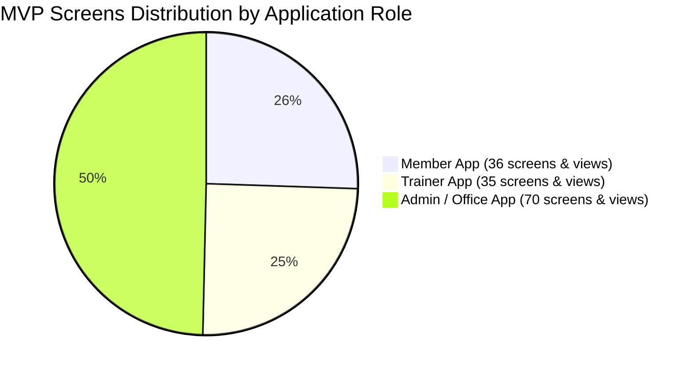

# Gym App — Complete MVP Screens Specification

This directory contains the comprehensive screen catalog and UI/UX navigation architecture for the **Gym Management System MVP**.

---

## Document Index

| Document | Role / Scope | Primary Navigation | Description |
| :--- | :--- | :--- | :--- |
| [**consolidated-screens.md**](file:///Users/admin/code/gym/docs/screens/consolidated-screens.md) | **Consolidated Screens (De-duplicated)** | Shared / Unified Matrix | Master de-duplicated catalog: reduces 141 role screens to 44 unified core screens with role-based UI variations. |
| [**navigation-architecture.md**](file:///Users/admin/code/gym/docs/screens/navigation-architecture.md) | **Navigation Architecture** | 5 Root Tabs per role | Details the simplified Flutter navigation strategy, routing stacks, modal interactions, and screen nesting. |
| [**member-app-screens.md**](file:///Users/admin/code/gym/docs/screens/member-app-screens.md) | **Member App** | `Home` · `Membership` · `Schedule` · `Progress` · `Profile` | 11 modules: Dashboard, Profile & Health, Membership, Schedule, Attendance, Payments, Personal Trainer, Workout, Diet, Goals & Progress, Notifications. |
| [**trainer-app-screens.md**](file:///Users/admin/code/gym/docs/screens/trainer-app-screens.md) | **Trainer App** | `Home` · `Members` · `Schedule` · `Plans` · `Profile` | 9 modules: Dashboard, Profile, Members, Schedule, Attendance, Workout Plans, Diet Plans, Goals & Progress, Notifications. |
| [**admin-app-screens.md**](file:///Users/admin/code/gym/docs/screens/admin-app-screens.md) | **Admin / Office App** | `Dashboard` · `Members` · `Memberships` · `Payments` · `More` | 15 modules: Dashboard, Members, Trainers, Employees, Memberships, Membership Products, Attendance, Payments, Schedules, Workout Management, Diet Management, Goals & Measurements, Notifications, Reports, Gym Settings. |

---

## Screen Count & Coverage Summary

### Core Architecture Highlights

1. **Role-Tailored Interfaces**:
   * **Member App**: Focuses on daily routines, quick attendance check-ins, workout and meal compliance, bookings, and transformation progress.
   * **Trainer App**: Focuses on client roster management, session calendar, creating tailored workout & diet plans, and client evaluation.
   * **Admin / Office App**: Focuses on complete 360° gym operations, sales billing, staff administration, hardware attendance feeds, and system configuration.

2. **Clean Navigation Discipline**:
   * Adheres strictly to **5 primary top-level tabs** per app to avoid cluttering mobile and desktop interfaces.
   * Leverages nested navigation stacks, contextual detail screens, bottom action sheets, and modal forms to house advanced sub-features.
