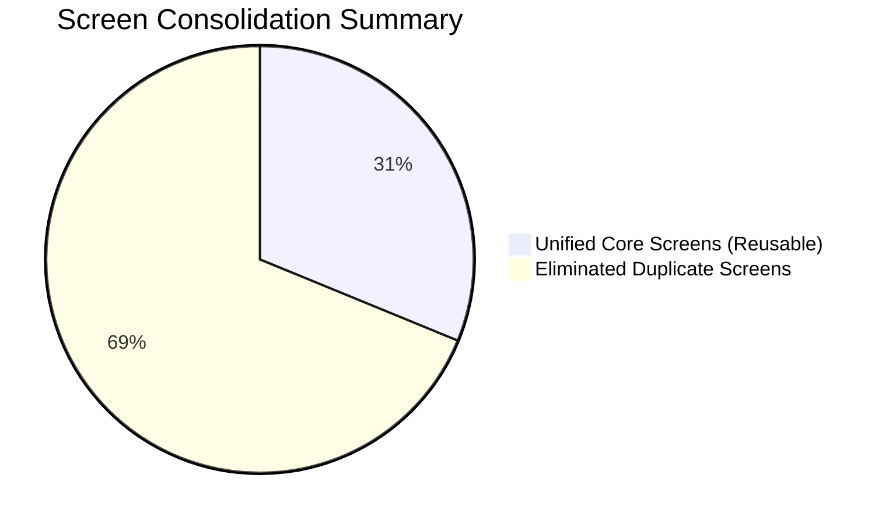

# Gym App — Consolidated MVP Screens (De-duplicated)

By consolidating identical and overlapping screens across **Member**, **Trainer**, and **Admin / Office** apps and treating role-based differences as **conditional permissions, editable vs. read-only fields, or adaptive widgets**, the total screen count is reduced from **141 duplicate references down to 44 unified screens**.

---

## Screen Reduction Overview



* **Gross Screen References Across 3 Apps:** 141
* **Net Consolidated Screens:** 44
* **Duplication Reduction:** ~68.8%

---

## Access Legend

| Symbol | Meaning |
| :---: | :--- |
| **F** | **Full Access** (Create, Read, Update, Delete / Manage) |
| **E** | **Edit / Manage** (Can create or edit within assigned scope) |
| **R** | **Read-Only / Self** (Can view own data or assigned clients only) |
| **C** | **Contextual Action** (Limited specific action, e.g., request freeze, mark attendance) |
| **—** | **Hidden / No Access** |

---

## Consolidated Master Screen Matrix

### 1. Dashboard Module

| # | Consolidated Screen Name | Member | Trainer | Admin | Role Variations & Adaptations |
| :-: | :--- | :---: | :---: | :---: | :--- |
| **01** | **Adaptive Dashboard** | **R** | **R** | **F** | **Member**: Shows membership status, today's workout/diet, check-in card, upcoming session.<br>**Trainer**: Shows today's client schedule, assigned member count, pending tasks.<br>**Admin**: Shows revenue, member count, turnstile occupancy, staff on duty, alerts. |

---

### 2. User & Profile Module

| # | Consolidated Screen Name | Member | Trainer | Admin | Role Variations & Adaptations |
| :-: | :--- | :---: | :---: | :---: | :--- |
| **02** | **Profile Screen** | **R** (Self) | **R** (Self/Client) | **F** (Any) | **Member**: Own profile with digital membership card.<br>**Trainer**: Own profile OR assigned client's 360° summary.<br>**Admin**: Any user's 360° master profile dossier. |
| **03** | **Edit Profile Screen** | **E** (Self) | **E** (Self) | **F** (Any) | **Member/Trainer**: Updates personal phone, email, bio, photo.<br>**Admin**: Can also modify roles, status, membership links, join dates. |
| **04** | **Health Information Screen** | **E** (Self) | **R** (Client) | **F** (Any) | **Member**: Fills out health questionnaire, allergies, vitals.<br>**Trainer**: Read-only safety briefing for assigned client.<br>**Admin**: Full audit and emergency access. |
| **05** | **Medical History Screen** | **E** (Self) | **R** (Client) | **F** (Any) | **Member**: Uploads doctor certificates, reports injuries.<br>**Trainer**: Views client contraindications & physical restrictions.<br>**Admin**: Stores legal waivers and clearance records. |
| **06** | **Emergency Contacts Screen** | **E** (Self) | **R** (Client) | **F** (Any) | Contact name, phone, relation. Editable by Member & Admin; readable by Trainer during emergencies. |
| **07** | **Documents & Photos Gallery** | **E** (Self) | **R** (Client) | **F** (Any) | **Member**: Uploads identity proofs & gym contract copies.<br>**Trainer**: Views client health clearance docs.<br>**Admin**: Uploads, approves, or deletes official member documents. |

---

### 3. Membership & Package Module

| # | Consolidated Screen Name | Member | Trainer | Admin | Role Variations & Adaptations |
| :-: | :--- | :---: | :---: | :---: | :--- |
| **08** | **Membership Details & Status** | **R** (Self) | **R** (Client) | **F** (Any) | **Member**: Active plan, remaining days, renewal CTA.<br>**Trainer**: Client's package type & remaining PT session count.<br>**Admin**: Full contract terms, locker assignment, renew/cancel actions. |
| **09** | **Membership History Screen** | **R** (Self) | **R** (Client) | **F** (Any) | Chronological log of past memberships, renewals, upgrades across all roles. |
| **10** | **Freeze & Extension Manager** | **C** (Request) | **—** | **F** (Approve) | **Member**: Request a freeze/hold with reason and view history.<br>**Admin**: Approve, reject, or manually adjust freeze/extension periods. |
| **11** | **Membership Packages Catalog** | **R** (Browse) | **—** | **F** (CRUD) | **Member**: Explores available plans to purchase/renew.<br>**Admin**: Full package builder (pricing, duration, access rights, active/archive status). |
| **12** | **Memberships Directory** | **—** | **—** | **F** | Filterable list of Active, Expiring, and Expired memberships across the gym (Admin only). |

---

### 4. Schedule & Bookings Module

| # | Consolidated Screen Name | Member | Trainer | Admin | Role Variations & Adaptations |
| :-: | :--- | :---: | :---: | :---: | :--- |
| **13** | **Schedule Calendar** | **R** (Self) | **E** (Assigned) | **F** (All) | **Member**: Personal calendar with booked PT and studio classes.<br>**Trainer**: Trainer's daily/weekly timetable with client names.<br>**Admin**: Master gym calendar across all trainers and rooms. |
| **14** | **Schedule Details Screen** | **C** (Cancel) | **E** (Manage) | **F** (All) | **Member**: Booking info, room, trainer bio, cancel button.<br>**Trainer**: Client list, session agenda, check-in button.<br>**Admin**: Edit session, reassign trainer, room capacity, participant roster. |
| **15** | **Create / Edit Booking Screen** | **C** (Book) | **E** (Book) | **F** (Any) | **Member**: Self-service booking modal (pick slot, confirm).<br>**Trainer**: Book PT appointment for a client.<br>**Admin**: Create recurring group classes or PT appointments. |
| **16** | **Trainer Availability Screen** | **R** (Slots) | **E** (Self) | **F** (Any) | **Member**: Read-only slot picker.<br>**Trainer**: Configure weekly shifts, break hours, days off.<br>**Admin**: Master roster configuration for all trainers. |
| **17** | **Schedule History Screen** | **R** (Self) | **R** (Self) | **F** (All) | Log of past completed, no-show, and cancelled bookings. |

---

### 5. Attendance Module

| # | Consolidated Screen Name | Member | Trainer | Admin | Role Variations & Adaptations |
| :-: | :--- | :---: | :---: | :---: | :--- |
| **18** | **Attendance Pass & Check-In** | **C** (Pass) | **E** (Session) | **F** (Desk/Gate)| **Member**: Personal digital entry barcode/QR code.<br>**Trainer**: Session check-off modal for attending clients.<br>**Admin**: Turnstile / front-desk manual check-in override. |
| **19** | **Attendance History Log** | **R** (Self) | **R** (Client) | **F** (All) | Timestamped audit log of all check-in/outs. Scoped to self for Member, client for Trainer, all for Admin. |
| **20** | **Attendance Analytics Dashboard**| **R** (Summary)| **R** (Client) | **F** (Gym-wide)| **Member**: Monthly visit streak and calendar heat map.<br>**Trainer**: Client adherence summary.<br>**Admin**: Real-time facility occupancy, peak hours heat map, reports. |

---

### 6. Payments & Billing Module

| # | Consolidated Screen Name | Member | Trainer | Admin | Role Variations & Adaptations |
| :-: | :--- | :---: | :---: | :---: | :--- |
| **21** | **Payments & Invoices Ledger** | **R** (Self) | **R** (Summary)| **F** (All) | **Member**: Personal invoices, paid & outstanding bills.<br>**Trainer**: Client fee clearance status summary badge.<br>**Admin**: Comprehensive financial ledger with revenue metrics. |
| **22** | **Record Payment / POS Screen** | **C** (Self-pay)| **—** | **F** (POS) | **Member**: Payment gateway checkout for renewal.<br>**Admin**: Full POS terminal (Cash, Card, UPI, split payment, discount). |
| **23** | **Payment Details Screen** | **R** (Self) | **—** | **F** (All) | Itemized breakdown: subtotal, taxes, discount, payment method, cashier. |
| **24** | **Payment Receipt Screen** | **R** (Download)| **—** | **F** (Print/Share)| Standard PDF/printable receipt viewable by payer and cashier. |
| **25** | **Outstanding Dues Screen** | **R** (Self Due)| **—** | **F** (All) | **Member**: "Pay Now" banner on overdue dues.<br>**Admin**: Filterable list of all members with overdue balances. |

---

### 7. Workout Management Module

| # | Consolidated Screen Name | Member | Trainer | Admin | Role Variations & Adaptations |
| :-: | :--- | :---: | :---: | :---: | :--- |
| **26** | **Workout Plans Catalog & List**| **R** (Assigned)| **E** (Clients) | **F** (Templates)| **Member**: Active routine & archived past plans.<br>**Trainer**: Roster of member plans + draft routines.<br>**Admin**: Gym master workout templates (Beginner, Fat Loss, etc.). |
| **27** | **Workout Plan Details Screen** | **R** (Self) | **E** (Manage) | **F** (All) | Day splits (e.g. Day 1: Chest), exercises, target sets/reps, notes. Editable by Trainer/Admin. |
| **28** | **Workout Plan Builder / Editor**| **—** | **E** | **F** | Interactive builder: split builder, exercise search, set/rep/rest assignments. |
| **29** | **Exercise Library Screen** | **R** (Browse) | **R** (Pick) | **F** (CRUD) | Searchable catalog categorized by muscle group & equipment. Admin can add/edit exercises. |
| **30** | **Exercise Details Modal/Screen**| **R** | **R** | **F** | Video/GIF demonstration, step-by-step cues, primary/secondary muscles. |
| **31** | **Live Workout Session Tracker** | **E** (Self) | **E** (Coaching)| **—** | Interactive workout logging: record completed sets, actual weight lifted, rest timer. |
| **32** | **Workout History Screen** | **R** (Self) | **R** (Client) | **F** (All) | Historical volume lifted, completed routines, and personal records (PRs). |

---

### 8. Diet & Nutrition Management Module

| # | Consolidated Screen Name | Member | Trainer | Admin | Role Variations & Adaptations |
| :-: | :--- | :---: | :---: | :---: | :--- |
| **33** | **Diet Plans Catalog & List** | **R** (Assigned)| **E** (Clients) | **F** (Templates)| **Member**: Active meal plan & archived past diets.<br>**Trainer**: Client diet plans + draft diets.<br>**Admin**: Gym master nutrition templates (Keto, Deficit, etc.). |
| **34** | **Diet Plan Details Screen** | **R** (Self) | **E** (Manage) | **F** (All) | Structured daily meals (Breakfast, Lunch, Dinner, Snacks), calorie & macro breakdown. |
| **35** | **Diet Plan Builder / Editor** | **—** | **E** | **F** | Calorie target calculator, macro ratio sliders, meal slot builder. |
| **36** | **Food Library Screen** | **—** | **R** (Pick) | **F** (CRUD) | Nutritional database per 100g/serving. Admin can add/edit custom foods. **Member**: no dedicated Food Library route — foods appear only via diet plan/log context. |
| **37** | **Diet History & Food Log** | **E** (Log) | **R** (Review) | **F** (All) | Member logs daily adherence; Trainer monitors compliance. |

---

### 9. Goals, Progress & Measurements Module

| # | Consolidated Screen Name | Member | Trainer | Admin | Role Variations & Adaptations |
| :-: | :--- | :---: | :---: | :---: | :--- |
| **38** | **Goals Hub & Details** | **R** (Self) | **E** (Client) | **F** (All) | Visual milestone tracker (Weight, Body Fat %, Strength). Trainer & Admin can create/edit goals. |
| **39** | **Measurements & History** | **E** (Self) | **E** (Client) | **F** (All) | Circumferences, body weight, BMI. Both Member and Trainer can record new readings. |
| **40** | **Progress Photos Gallery** | **E** (Upload) | **R** (Client) | **F** (Moderate)| Side-by-side transformation comparison (Front, Side, Back) with privacy safeguards. |
| **41** | **Progress Notes Screen** | **E** (Self) | **E** (Coach) | **F** (All) | Dual notes stream: Member subjective notes + Trainer coaching remarks. |

---

### 10. Notifications & Communication Module

| # | Consolidated Screen Name | Member | Trainer | Admin | Role Variations & Adaptations |
| :-: | :--- | :---: | :---: | :---: | :--- |
| **42** | **Notifications Inbox & Details**| **R** (Self) | **R** (Self) | **R** (All) | Unified notifications center: session alerts, fee dues, announcements, direct messages. |
| **43** | **Broadcast / Send Notification**| **—** | **C** (Assigned)| **F** (All) | **Trainer**: Message assigned clients.<br>**Admin**: Broadcast push/SMS/email to all members, expiring list, or staff. |

---

### 11. Gym Management & System Admin Module (Admin / Staff Only)

| # | Consolidated Screen Name | Member | Trainer | Admin | Role Variations & Adaptations |
| :-: | :--- | :---: | :---: | :---: | :--- |
| **44** | **Staff Directory & Roles** | **—** | **—** | **F** | Combined management for Trainers & Employees with 840dp master–detail layout, status filtering (`All`/`Active`/`Inactive`), atomic onboarding, role assignment, and direct modular domain links (Scheduling, Attendance, Reports, Member Dossiers). |
| **45** | **Reports & Business Analytics** | **—** | **R** (Own PT) | **F** (Full) | **Trainer**: View own sessions & retention rate.<br>**Admin**: Comprehensive financial, membership, churn, and attendance analytics. |
| **46** | **Gym & Hardware Settings** | **—** | **—** | **F** | Gym profile, turnstile & biometric gate sync, booking rules, tax settings, metrics config. |

*(Note: Screens 44, 45, and 46 handle staff management, gym reports, and settings that are exclusive to Admin, with Trainer having limited read access to their own performance report).*

---

## Implementation Architecture in Flutter

To implement this de-duplicated design in Flutter:

```
lib/
├── features/
│   ├── dashboard/
│   │   └── presentation/screens/dashboard_screen.dart   <-- Adaptive widgets by Role (Member/Trainer/Admin)
│   ├── profile/
│   │   ├── presentation/screens/profile_screen.dart     <-- Reused for Self, Client Dossier, & Admin Master
│   │   ├── presentation/screens/edit_profile_screen.dart
│   │   ├── presentation/screens/health_info_screen.dart
│   │   └── presentation/screens/documents_screen.dart
│   ├── membership/
│   │   ├── presentation/screens/membership_details_screen.dart
│   │   └── presentation/screens/packages_catalog_screen.dart
│   ├── schedule/
│   │   ├── presentation/screens/schedule_calendar_screen.dart
│   │   └── presentation/screens/schedule_details_screen.dart
│   ├── attendance/
│   │   ├── presentation/screens/attendance_pass_screen.dart
│   │   └── presentation/screens/attendance_history_screen.dart
│   ├── payments/
│   │   ├── presentation/screens/payments_ledger_screen.dart
│   │   └── presentation/screens/pos_checkout_screen.dart
│   ├── workouts/
│   │   ├── presentation/screens/workout_plan_details_screen.dart
│   │   ├── presentation/screens/workout_plan_builder_screen.dart
│   │   ├── presentation/screens/exercise_library_screen.dart
│   │   └── presentation/screens/live_workout_tracker_screen.dart
│   ├── diet/
│   │   ├── presentation/screens/diet_plan_details_screen.dart
│   │   ├── presentation/screens/diet_plan_builder_screen.dart
│   │   └── presentation/screens/food_library_screen.dart
│   ├── progress/
│   │   ├── presentation/screens/goals_hub_screen.dart
│   │   ├── presentation/screens/measurements_screen.dart
│   │   └── presentation/screens/progress_photos_screen.dart
│   └── notifications/
│       └── presentation/screens/notifications_inbox_screen.dart
```

### Key Benefits of this Consolidation:
1. **Single Source of Truth**: Changes to workout logic, payment calculations, or schedule displays are updated in one widget instead of three.
2. **Role-Based Widget Decorators**: Screens use simple capability checks (e.g., `user.canEdit(workoutPlan)`) to toggle between view mode and builder mode.
3. **Massive Code Reduction**: Decreases frontend codebase size by ~65%, drastically cutting maintenance overhead and bug surface area.
