# MVP Navigation Architecture & Routing Guidelines

## Philosophy & UX Strategy

For a complete gym management suite across mobile, tablet, and desktop (built with Flutter), **exposing every screen as a direct menu item leads to overwhelming navigation and poor usability**.

Instead, the UI utilizes a **Simplified Top-Level Navigation** (5 primary tabs per role) where every secondary feature, log, configuration, and history screen is accessed as a **nested route, detail screen, contextual modal, or action sheet**.

---

## 1. Top-Level Navigation Summary by App

| App Role | Top-Level Navigation Items (Bottom Bar / Side Rail) |
| :--- | :--- |
| **Member App** | `Home` · `Membership` · `Schedule` · `Progress` · `Profile` |
| **Trainer App** | `Home` · `Members` · `Schedule` · `Plans` · `Profile` |
| **Admin / Office App** | `Dashboard` · `Members` · `Memberships` · `Payments` · `More` |

---

## 2. Member App Navigation Hierarchy

```mermaid
graph TD
    MemberApp[Member App Root] --> Home[1. Home Tab]
    MemberApp --> Membership[2. Membership Tab]
    MemberApp --> Schedule[3. Schedule Tab]
    MemberApp --> Progress[4. Progress Tab]
    MemberApp --> Profile[5. Profile Tab]

    Home --> HW1[Quick Membership Status]
    Home --> HW2[Today's Schedule]
    Home --> HW3[Attendance Summary]
    Home --> HW4[Current Workout]
    Home --> HW5[Current Diet]
    Home --> HW6[Goals/Progress Summary]
    Home --> Notif[Notifications Tray]

    Membership --> M1[Current Membership Details]
    Membership --> M2[Membership Package Details]
    Membership --> M3[Membership History]
    Membership --> M4[Freeze / Extension History]

    Schedule --> S1[My Schedule Calendar]
    Schedule --> S2[PT Sessions Filter]
    Schedule --> S3[Class / Gym Sessions Filter]
    Schedule --> S4[Schedule Details Screen]
    Schedule --> S5[Schedule History]

    Progress --> P1[My Goals List]
    Progress --> P2[Goal Details Screen]
    Progress --> P3[Progress Overview Analytics]
    Progress --> P4[Measurements & History]
    Progress --> P5[Progress Photos Gallery]
    Progress --> P6[Progress Notes]

    Profile --> PR1[Edit Profile]
    Profile --> PR2[Health Information & Medical History]
    Profile --> PR3[Emergency Contacts]
    Profile --> PR4[Documents & Photos]
    Profile --> PR5[Payments & Invoices History]
    Profile --> PR6[My Trainer Profile]
    Profile --> PR7[Attendance Log]
```

### Member Routing Structure

* **`Home` Stack**:
  * `/home` (Dashboard root)
  * `/home/workout/active` (Workout Session live tracker)
  * `/home/diet/meal/:id` (Meal Details)
  * `/notifications` (Notification list and detail)
* **`Membership` Stack**:
  * `/membership` (Current plan status)
  * `/membership/packages` (Browse available packages)
  * `/membership/history` (Renewal & past plan history)
  * `/membership/freeze-history` (Freeze & extension log)
* **`Schedule` Stack**:
  * `/schedule` (Calendar view)
  * `/schedule/:id` (Booking detail)
  * `/schedule/book-pt` (Book PT session flow)
  * `/schedule/book-class` (Reserve class spot)
  * `/schedule/history` (Past bookings)
* **`Progress` Stack**:
  * `/progress` (Goals dashboard)
  * `/progress/goal/:id` (Goal detail & milestones)
  * `/progress/measurements` (Current measurements & history)
  * `/progress/photos` (Transformation gallery)
  * `/progress/notes` (Personal & coach notes)
* **`Profile` Stack**:
  * `/profile` (Profile landing)
  * `/profile/edit` (Edit profile form)
  * `/profile/health` (Health info & medical records)
  * `/profile/emergency-contacts` (Emergency contact list)
  * `/profile/documents` (Uploaded documents)
  * `/profile/payments` (Payment receipts & invoice history)
  * `/profile/trainer` (Assigned trainer profile)
  * `/profile/attendance` (Attendance calendar and monthly summary)

---

## 3. Trainer App Navigation Hierarchy

```mermaid
graph TD
    TrainerApp[Trainer App Root] --> Home[1. Home Tab]
    TrainerApp --> Members[2. Members Tab]
    TrainerApp --> Schedule[3. Schedule Tab]
    TrainerApp --> Plans[4. Plans Tab]
    TrainerApp --> Profile[5. Profile Tab]

    Home --> TH1[Today's Schedule & Sessions]
    Home --> TH2[Assigned Members Overview]
    Home --> TH3[Pending Tasks]
    Home --> TH4[Member Progress Summary]
    Home --> TH5[Notifications]

    Members --> MSearch[Search & Filter]
    Members --> MProfile[Member Profile Dossier]
    MProfile --> MHealth[Member Health & Medical History]
    MProfile --> MMem[Member Membership & PT Balance]
    MProfile --> MAtt[Member Attendance History]
    MProfile --> MSched[Member Booked Sessions]
    MProfile --> MPay[Member Payment Summary]
    MProfile --> MGoal[Member Goals & Measurements]

    Schedule --> Scal[Schedule Calendar]
    Schedule --> Sdetail[Session Details]
    Schedule --> SAvail[Trainer Availability Config]
    Schedule --> SAtt[Session Attendance Check-off]
    Schedule --> SHist[Schedule History]

    Plans --> WPlans[Workout Plans Builder & Library]
    WPlans --> WCreate[Create / Edit Workout Plan]
    WPlans --> WExercise[Add Exercises & Exercise Details]
    WPlans --> WSession[Start Live Workout Session]
    Plans --> DPlans[Diet Plans Builder & Library]
    DPlans --> DCreate[Create / Edit Diet Plan]
    DPlans --> DFoods[Add Meals & Food Details]

    Profile --> TEdit[Edit Profile & Credentials]
```

### Trainer Routing Structure

* **`Home` Stack**:
  * `/trainer/home` (Dashboard root)
  * `/trainer/sessions/today` (Today's session list)
  * `/trainer/notifications` (Notifications & alerts)
* **`Members` Stack**:
  * `/trainer/members` (Directory of assigned clients)
  * `/trainer/members/:id` (Member dossier)
  * `/trainer/members/:id/health` (Health & medical records)
  * `/trainer/members/:id/goals` (Goals, measurements, progress photos)
  * `/trainer/members/:id/goals/add-measurement` (Record new measurement)
* **`Schedule` Stack**:
  * `/trainer/schedule` (Interactive calendar)
  * `/trainer/schedule/:id` (Session detail & attendance check-in)
  * `/trainer/schedule/availability` (Shift timings & off days)
  * `/trainer/schedule/history` (Completed sessions archive)
* **`Plans` Stack**:
  * `/trainer/plans` (Tabbed root: Workouts | Diets)
  * `/trainer/plans/workouts/create` (Workout builder)
  * `/trainer/plans/workouts/:id` (Workout plan details & exercises)
  * `/trainer/plans/diets/create` (Diet builder)
  * `/trainer/plans/diets/:id` (Diet plan details & meals)
  * `/trainer/plans/exercises/:id` (Exercise instructions & demo)
* **`Profile` Stack**:
  * `/trainer/profile` (Trainer credentials & settings)
  * `/trainer/profile/edit` (Edit bio, specialty, contact)

---

## 4. Admin / Office App Navigation Hierarchy

```mermaid
graph TD
    AdminApp[Admin App Root] --> Dashboard[1. Dashboard Tab]
    AdminApp --> Members[2. Members Tab]
    AdminApp --> Memberships[3. Memberships Tab]
    AdminApp --> Payments[4. Payments Tab]
    AdminApp --> More[5. More Tab / Drawer]

    Dashboard --> DSummary[Member, Revenue & Attendance Summaries]
    Dashboard --> DExpiring[Expiring Memberships Widget]
    Dashboard --> DRecent[Recent Payments Feed]
    Dashboard --> DNotif[Alerts & Notifications]

    Members --> MList[Members Master Directory]
    Members --> MAdd[Add Member Wizard]
    Members --> M360[Member 360° Profile Hub]
    M360 --> MAllDocs[Health, Medical, Attendance, Payments, Plans]

    Memberships --> MemActive[Active Memberships List]
    Memberships --> MemExpiring[Expiring Memberships List]
    Memberships --> MemExpired[Expired Memberships List]
    Memberships --> MemActions[Renew / Freeze / Extension Actions]

    Payments --> POS[Record Payment / POS Terminal]
    Payments --> PList[All Payment Transactions History]
    Payments --> PReceipt[Receipt Viewer & Print]
    Payments --> PDue[Pending / Outstanding Dues]

    More --> MTrainers[Trainers Management]
    More --> MEmp[Employees & Staff Roles]
    More --> MPackages[Membership Packages Master]
    More --> MAttendance[Attendance Dashboard & Hardware Feed]
    More --> MSchedules[Gym Schedules & Availability Matrix]
    More --> MWorkoutLib[Exercise Library & Master Plans]
    More --> MDietLib[Food Library & Master Diets]
    More --> MMetrics[Goal Metrics Configuration]
    More --> MReports[Reports Suite: Revenue, Attendance, Churn]
    More --> MSettings[Gym Settings: General, Hardware, Policies]
```

### Admin Routing Structure

* **`Dashboard` Stack**:
  * `/admin/dashboard` (Command center)
  * `/admin/alerts` (System alerts & notices)
* **`Members` Stack**:
  * `/admin/members` (Directory table/list)
  * `/admin/members/add` (Onboarding wizard)
  * `/admin/members/:id` (Member 360° profile)
  * `/admin/members/:id/edit` (Edit details)
  * `/admin/members/:id/assign-membership` (Assign package)
* **`Memberships` Stack**:
  * `/admin/memberships` (Segmented: Active, Expiring, Expired)
  * `/admin/memberships/:id` (Contract details)
  * `/admin/memberships/:id/renew` (Quick renewal)
  * `/admin/memberships/:id/freeze` (Freeze / extension)
* **`Payments` Stack**:
  * `/admin/payments` (Collections ledger)
  * `/admin/payments/record` (POS billing form)
  * `/admin/payments/:id` (Transaction voucher & receipt)
  * `/admin/payments/outstanding` (Unpaid dues)
* **`More` (Menu / Side Navigation Rail)**:
  * `/admin/trainers` (Trainer list & profiles)
  * `/admin/employees` (Staff list, profiles, roles)
  * `/admin/packages` (Membership packages catalog)
  * `/admin/attendance` (Attendance dashboard, live feed, records)
  * `/admin/schedules` (Master gym schedules calendar)
  * `/admin/workout-library` (Exercise library & master workout plans)
  * `/admin/diet-library` (Food database & master diet plans)
  * `/admin/goal-metrics` (Goal metrics & progress audit)
  * `/admin/notifications/broadcast` (Send push/SMS notifications)
  * `/admin/reports/:category` (Reports for revenue, attendance, staff)
  * `/admin/settings/:category` (Gym, hardware, biometric, and policy settings)

---

## 5. UI Presentation Patterns

1. **Root Tabs**:
   * Mobile: Bottom Navigation Bar with 5 fixed tabs.
   * Tablet / Desktop: Left-hand Persistent Navigation Rail or Expandable Drawer.
2. **Detail Pages**:
   * Pushed to the current tab stack with a persistent back arrow (`AppBar` back button).
3. **Quick Forms & Creation Wizards**:
   * Pushed as full-screen modal sheets or slide-over side drawers on larger viewports.
4. **Contextual Actions (Attendance check-off, freeze, quick renew)**:
   * Accessible via Bottom Sheets or Dialog Popups without leaving the current screen context.
